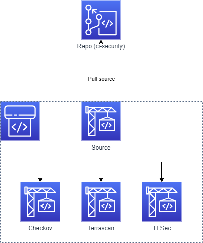

# Example of CI pipeline for security checks of Terraform template

This repository contains a simple example and comparision of three tools, which can be used for security checks.

These tools are:

## Checkov

Owned by: BridgeCrew  
Webpage: https://www.checkov.io/  
Github: https://github.com/bridgecrewio/checkov  

## Terrascan

Owned by: Accurics (aquired by Tenable)  
Webpage: https://www.accurics.com/developers/terrascan/  
Github: https://github.com/accurics/terrascan  

## TFSec

Owned by: Aqua Security  
Webpage: https://tfsec.dev/   
Github: https://github.com/aquasecurity/tfsec  

## Configuration

This example uses IaC with CloudFormation to create simple pipeline which executes all three tools simultanously.

### Important

* Repository named `ci-security` is hardcoded  
* Repo is in CodeCommit  
* IaC assumes, the repo is already created  
* You have to upload any TF templates to the repo in orderto run tests  
* IAM in this example is not... perfect ;)

## Diagram

